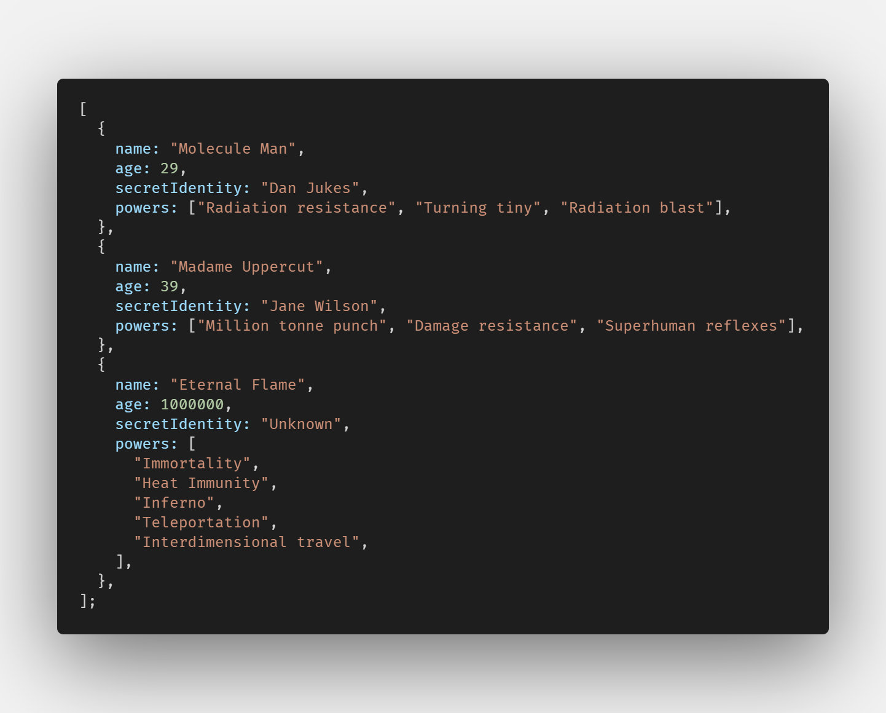
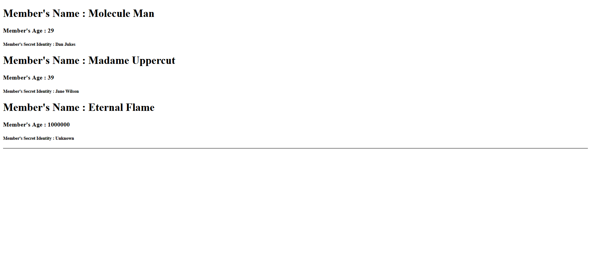

# React-Beginner-Props-Map

Sample of react's props using map() to a set of array.

&nbsp;
&nbsp;
&nbsp;

## References

- [Learn React JS - Full Course for Beginners - Tutorial 2019](https://youtu.be/DLX62G4lc44)
  
&nbsp;
&nbsp;
&nbsp;

## Json Data

&nbsp;

&nbsp;
&nbsp;
&nbsp;

## Result

&nbsp;
<kbd></kbd>
